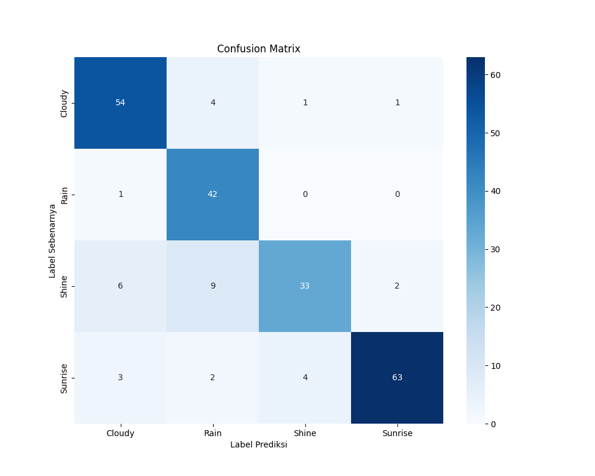

# Klasifikasi Cuaca Berbasis Gambar

Model untuk mengklasifikasikan gambar ke dalam empat kategori cuaca:

- **Berawan (Cloudy)**
- **Hujan (Rain)**
- **Cerah (Shine)**
- **Matahari Terbit (Sunrise)**

**Sumber Dataset:** [Kaggle](https://www.kaggle.com/datasets/pratik2901/multiclass-weather-dataset)
Model mencapai **akurasi 95.88%** pada data uji.

---

## Laporan Klasifikasi Detail

| Kelas    | Precision | Recall | F1-Score | Support |
|----------|-----------|--------|----------|---------|
| Cloudy   | 0.95      | 0.97   | 0.96     | 240     |
| Rain     | 0.94      | 0.98   | 0.96     | 171     |
| Shine    | 0.96      | 0.92   | 0.94     | 202     |
| Sunrise  | 0.98      | 0.97   | 0.97     | 286     |
| **Total / Accuracy** | — | — | **0.96** | **899** |
| **Macro Avg** | 0.96 | 0.96 | 0.96 | 899 |
| **Weighted Avg** | 0.96 | 0.96 | 0.96 | 899 |

---

## Confusion Matrix


---

## Ringkasan

**Metode**
- **Ekstraksi Fitur:** Kombinasi HOG (bentuk), Color Histogram (warna), dan LBP (tekstur).
- **Reduksi Dimensi:** PCA untuk mengatasi *curse of dimensionality* dan overfitting.
- **Klasifikasi:** Support Vector Machine (SVM) dengan kernel RBF.
- **Dataset:** Multi-class Weather Dataset dari Kaggle — 4 kelas, ~1125 gambar awal.
- **Hasil Akhir:** Akurasi **95.88%** pada set data pengujian.

---

## Panduan

### Prasyarat
- Python 3.8+
- Git

### Instalasi

```bash
git clone https://github.com/secessuss/klasifikasi-cuaca-svm.git
cd klasifikasi-cuaca-svm
```

Buat dan aktifkan lingkungan virtual:

```bash
python -m venv venv
# Windows:
venv\Scripts\activate
# macOS/Linux:
source venv/bin/activate
```

Instal dependensi:

```bash
pip install -r requirements.txt
```

---

## Cara Menjalankan Pelatihan

### 1. Pelatihan Model (Dianjurkan)
Jalankan Jupyter Notebook untuk visibilitas proses:

```bash
jupyter notebook
```

Buka `svm/notebooks/training.ipynb` dan jalankan semua sel. Model akan disimpan di `svm/saved_models/`.

### 2. Melakukan Prediksi (Dianjurkan)
Siapkan gambar baru di `svm/data/new_images/`.  
Buka `svm/notebooks/prediction.ipynb` dan jalankan setelah menyesuaikan nama file gambar.

---

# Tampilan Demo Web

## Form Upload Klasifikasi Cuaca


## Halaman Hasil Prediksi


---

# Panduan Aplikasi Web

## Prasyarat

- **Lingkungan sudah terinstal**  
  Pastikan Anda sudah mengikuti langkah-langkah instalasi, termasuk menjalankan:
  ```bash
  pip install -r requirements.txt
  ```

- **Model tersedia**  
  Pastikan file model `svm_model_integrated.pkl` berada di:
  ```
  web/model/
  ```

- **Unduh Model:** [Release](https://github.com/secessuss/klasifikasi-cuaca-svm/releases)

---

## Langkah-langkah Menjalankan

### Pindah ke folder aplikasi (web)
Dari direktori root proyek, jalankan:
```bash
cd web
```

### Jalankan aplikasi Flask
```bash
python app.py
```

Aplikasi akan berjalan pada `http://127.0.0.1:5000` secara default (atau alamat yang ditampilkan di terminal).

### Akses aplikasi
Buka browser dan kunjungi:
```
http://127.0.0.1:5000
```

Sekarang Anda bisa mengunggah gambar dan melihat hasil prediksi.

---

## Troubleshooting

- Jika muncul error `ModuleNotFoundError`, pastikan `venv` aktif dan dependensi sudah terpasang.  
- Jika model tidak ditemukan, periksa lokasi `web/model/svm_model_integrated.pkl`.  
- Jika port 5000 sudah dipakai, jalankan Flask pada port lain:
  ```bash
  python app.py --port 5001
  ```

---