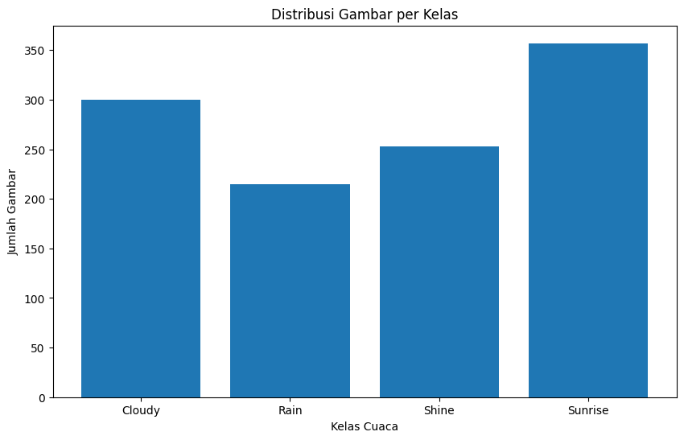
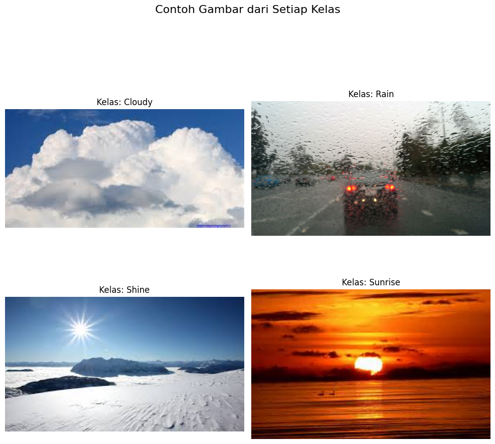

## Analisis Data Eksplorasi (Exploratory Data Analysis - EDA)

Merinci tentang dataset yang digunakan serta temuan-temuan penting dari analisis data eksplorasi awal.

* **Dataset**: *Multi-class Weather Dataset* dari Kaggle
* **Total Gambar**: 1125 gambar berwarna
* **Format**: Mayoritas `.jpg`
* **Struktur Folder**: Terorganisir ke dalam sub-folder sesuai kelas cuaca

### Pembagian Kelas

Dataset terdiri dari 4 kelas:

* **Cloudy (Berawan)**: Didominasi awan di langit
* **Rain (Hujan)**: Kondisi hujan, gelap, dengan butiran air
* **Shine (Cerah/Terik)**: Langit cerah atau kondisi siang hari yang terik
* **Sunrise (Matahari Terbit)**: Warna oranye/merah hangat dari matahari terbit

---

### Distribusi Kelas

Jumlah gambar per kelas:

* Cloudy: 300
* Rain: 215
* Shine: 253
* Sunrise: 357

**Grafik Distribusi Kelas:**

**Analisis:**
Distribusi kelas relatif seimbang, meskipun tidak sempurna. Sunrise paling banyak, Rain paling sedikit. Untuk mengatasi potensi bias, digunakan parameter `class_weight='balanced'` pada model SVM.

---

### Variasi Ukuran & Resolusi

* **Temuan**: Ukuran gambar sangat bervariasi (ada resolusi rendah hingga tinggi).
* **Implikasi**: Semua gambar distandarisasi ke ukuran `128x128 px` agar vektor fitur memiliki dimensi seragam.

---

### Tinjauan Visual Sampel Gambar

Beberapa contoh gambar dari setiap kelas:

**Analisis Visual:**

* Cloudy vs. Rain → bisa jadi mirip karena dominasi warna abu-abu/gelap.
* Shine vs. Sunrise → dibedakan oleh dominasi warna (biru vs oranye).
* Ada gambar ambigu yang sulit diklasifikasikan bahkan oleh manusia.

---

[Kembali ke README](../README.md)
