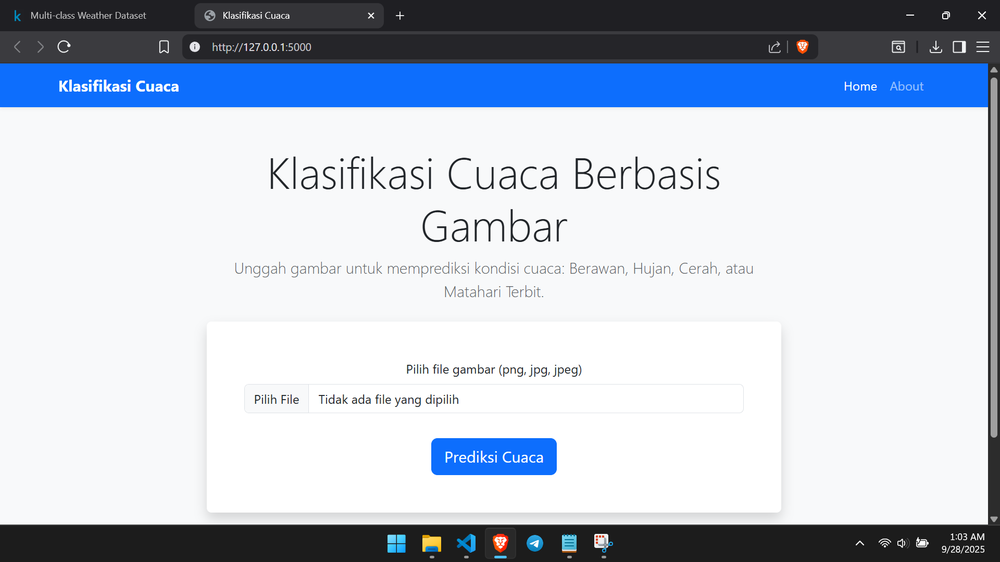
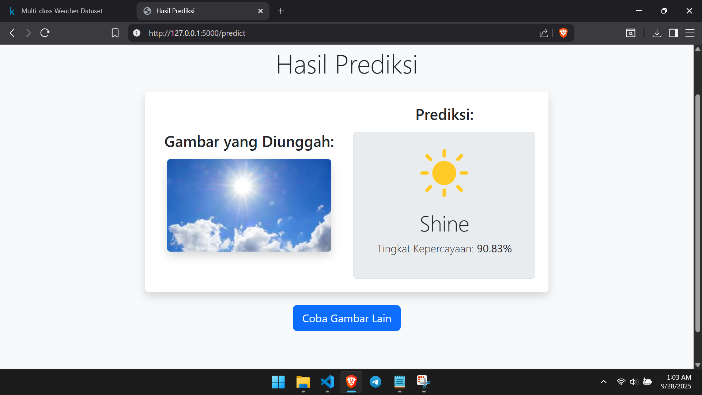

# Panduan Deploy Aplikasi Web

Panduan ini ditujukan untuk **men-deploy aplikasi web** yang menyediakan antarmuka pengguna sederhana untuk **mengunggah gambar cuaca** dan mendapatkan prediksi dari model machine learning.

---

## Fitur

* **Unggah Gambar**: Pilih dan unggah file (.jpg, .png, .jpeg).
* **Prediksi Otomatis**: Gambar diproses lalu hasil prediksi ditampilkan langsung.
* **Tampilan Hasil**: Menampilkan:

  * Gambar yang diunggah
  * Label cuaca yang diprediksi
  * Ikon sesuai kelas
  * Confidence score (%)
* **Halaman About**: Menjelaskan metodologi dan dataset proyek.

---

## Teknologi

* **Backend**: Flask (Python)
* **Frontend**: HTML, CSS, Bootstrap 5
* **Templating**: Jinja2
* **Library Python**: scikit-learn, Pillow, NumPy, Joblib

---

## Struktur Folder `web/`

```
web/
│
├── app.py                # File utama aplikasi Flask
├── preprocess.py         # Fungsi prapemrosesan gambar
├── requirements.txt      # Dependensi aplikasi web
│
├── model/
│   └── svm_model.pkl     # Model machine learning terlatih
│
├── static/
│   ├── css/
│   │   └── style.css     # CSS kustom
│   ├── icons/            # Ikon cuaca (SVG)
│   └── uploads/          # Tempat penyimpanan gambar unggahan (otomatis dibuat)
│
└── templates/
    ├── index.html        # Halaman utama (form upload)
    ├── result.html       # Halaman hasil prediksi
    └── about.html        # Halaman "Tentang Proyek"
```

---

## Panduan Instalasi & Deploy

### 1. Clone Repositori (Jika belum)

```bash
git clone https://github.com/secessuss/klasifikasi-cuaca-svm.git
cd klasifikasi-cuaca-svm/web
```

---

### 2. Prasyarat

* Python 3.9 atau lebih baru
* File model `svm_model.pkl` tersedia di folder `web/model/`

> Jika Anda tidak ingin melakukan training dari awal, gunakan model terlatih yang sudah tersedia di sini:
> [📥 Unduh Model Terlatih (svm_model.pkl)](https://github.com/secessuss/klasifikasi-cuaca-svm/releases)

Setelah diunduh, letakkan file `svm_model.pkl` ke folder:

```
web/model/
```

---

### 3. Buat Lingkungan Virtual

```bash
python -m venv venv
```

Aktifkan lingkungan virtual:

* **Windows**

  ```bash
  venv\Scripts\activate
  ```
* **macOS / Linux**

  ```bash
  source venv/bin/activate
  ```

---

### 4. Instal Dependensi

```bash
pip install -r requirements.txt
```

---

### 5. Jalankan Aplikasi (Local Deploy)

```bash
python app.py
```

---

### 6. Akses di Browser

Buka browser lalu kunjungi:
[http://127.0.0.1:5000](http://127.0.0.1:5000)

---

## Screenshot Aplikasi

### Halaman Upload



### Hasil Prediksi



---

[Kembali ke README](../README.md)
