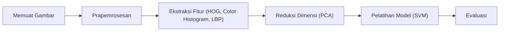

## Metodologi

Menjelaskan secara rinci alur kerja teknis (pipeline) yang dibangun untuk melatih dan mengevaluasi model klasifikasi cuaca.

---

### Arsitektur Pipeline Keseluruhan

Pipeline dirancang modular dengan Python & Scikit-learn.
Setiap tahap (prapemrosesan → ekstraksi fitur → reduksi dimensi → pelatihan → evaluasi) dikelola dalam skrip terpisah.

**Diagram Alur Kerja:**

---

### Tahap Prapemrosesan Gambar

1. **Resize (Mengubah Ukuran)**

   * **Tujuan**: Menyamakan dimensi semua gambar.
   * **Implementasi**: Semua gambar diubah ke `128x128 px` dengan `cv2.resize()`.
   * **Alasan**: Kompromi antara detail visual dan efisiensi komputasi.

2. **Konversi Ruang Warna**

   * **Grayscale** → untuk fitur bentuk & tekstur (HOG & LBP).
   * **HSV (Hue, Saturation, Value)** → untuk fitur warna (Color Histogram).
   * Implementasi dengan `cv2.cvtColor()`.

3. **Normalisasi**

   * Nilai piksel [0–255] diubah ke [0.0–1.0] dengan membagi 255.
   * Membantu konvergensi algoritma lebih cepat.

---

### Tahap Ekstraksi Fitur

Alih-alih memakai piksel mentah, pipeline mengekstrak fitur representatif:

* **Histogram of Oriented Gradients (HOG)**

  * Target: Bentuk & kontur.
  * Menangkap distribusi arah gradien → efektif untuk kontur awan / horizon.

* **Color Histogram (HSV)**

  * Target: Distribusi warna.
  * Membedakan kelas seperti *Sunrise* (oranye) vs *Shine* (biru).

* **Local Binary Patterns (LBP)**

  * Target: Tekstur.
  * Menggambarkan pola tekstur halus pada awan atau permukaan.

Semua vektor digabung (concatenated) → menghasilkan **8370 dimensi fitur per gambar**.

---

### Optimisasi Pipeline

Pipeline awal → **gagal total (akurasi ~42%)** karena curse of dimensionality + data terbatas.
Solusi:

1. **Data Augmentation**

   * **Tujuan**: Menambah variasi data latih.
   * **Transformasi**:

     * Horizontal Flip
     * Perubahan Kecerahan (lebih terang / lebih gelap)
   * **Hasil**: Data latih meningkat dari ~898 → ~2695 sampel.

2. **Principal Component Analysis (PCA)**

   * **Tujuan**: Reduksi dimensi & noise filtering.
   * **Implementasi**: PCA mempertahankan **95% varians data**.
   * **Hasil**: Fitur berkurang drastis → dari **8370 → 1114 komponen utama**.

---

### Model Klasifikasi: Support Vector Machine (SVM)

* **Alasan Pemilihan**: Cocok untuk data berdimensi tinggi & batas keputusan non-linear.
* **Kernel**: `RBF (Radial Basis Function)` → fleksibel menangani hubungan kompleks.
* **Penyeimbangan Kelas**: `class_weight='balanced'` → mengatasi distribusi kelas tidak seimbang.
* **Hyperparameter Tuning**:

  * Dilakukan dengan `GridSearchCV` untuk mencari kombinasi optimal (`C`, `gamma`).
  * Validasi silang (cross-validation) memastikan generalisasi model.

---

[Kembali ke README](../README.md)
