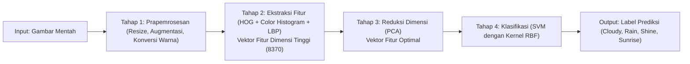

# Gambaran Umum Proyek

Pnjelasan singkat mengenai arsitektur klasifikasi cuaca yang dibangun.

---

## Arsitektur

---

## Ringkasan
- **Input:** Gambar mentah  
- **Prapemrosesan:** Resize, augmentasi, konversi warna  
- **Ekstraksi fitur:** HOG + Color Histogram + LBP  
- **Reduksi dimensi:** PCA  
- **Klasifikasi:** SVM dengan kernel RBF  
- **Output:** Label prediksi cuaca

---