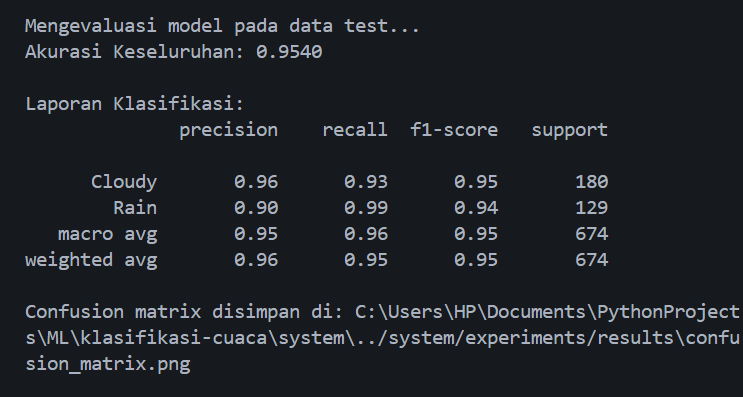
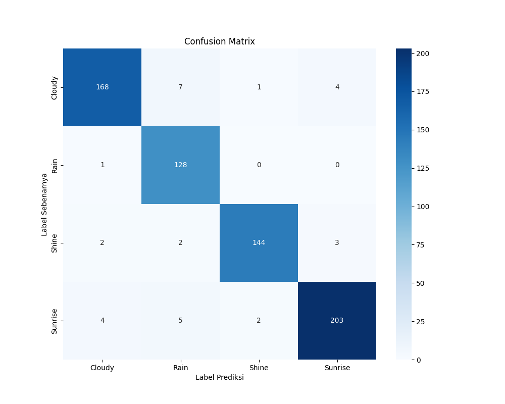

# Klasifikasi Gambar Cuaca

## Tujuan Proyek

* **Membangun Pipeline Klasifikasi**
  Merancang alur kerja (pipeline) lengkap mulai dari pemrosesan gambar, ekstraksi fitur, hingga pelatihan model klasifikasi.

* **Menerapkan Metode Ekstraksi Fitur**
  Menggunakan kombinasi teknik ekstraksi fitur klasik:

  * Histogram of Oriented Gradients (HOG)
  * Color Histogram
  * Local Binary Patterns (LBP)

* **Melatih dan Mengevaluasi Model**
  Menggunakan Support Vector Machine (SVM) untuk klasifikasi dan mengevaluasi kinerjanya secara kuantitatif.

* **Mengatasi Tantangan Overfitting**
  Menganalisis dan mengimplementasikan solusi terhadap curse of dimensionality (fitur terlalu banyak) dan data terbatas.

* **Mencapai Akurasi Tinggi**
  Menghasilkan model akhir dengan akurasi tinggi dan seimbang di semua kelas cuaca.

---

## Dataset yang Digunakan

* **Sumber**: [Multi-class Weather Dataset – Kaggle](https://www.kaggle.com/datasets/pratik2901/multiclass-weather-dataset/)
* **Jumlah Kelas**: 4 kelas

  * Cloudy (Berawan)
  * Rain (Hujan)
  * Shine (Cerah/Terik)
  * Sunrise (Matahari Terbit)
* **Total Gambar Awal**: 1125 gambar

---

## Eksperimen

### Eksperimen Awal

* Pipeline dasar dengan **HOG + Color Histogram + LBP** → dimasukkan langsung ke SVM.
* Hasil: Akurasi sangat rendah (~42%) akibat jumlah fitur sangat tinggi dibandingkan data latih.

### Eksperimen Perbaikan

Pipeline dioptimalkan dengan:

* **Data Augmentation** → Melipatgandakan data latih untuk meningkatkan generalisasi.
* **Principal Component Analysis (PCA)** → Reduksi dimensi fitur signifikan untuk mengatasi overfitting dan fokus pada informasi relevan.

---

## Hasil Akhir

* **Akurasi Awal**: `42.2%`
* **Akurasi Akhir (dengan Augmentation + PCA)**: `95.4%`

> Peningkatan besar berkat kombinasi *Data Augmentation* dan *PCA*.

---

### Visualisasi

---

[Kembali ke README](../README.md)
